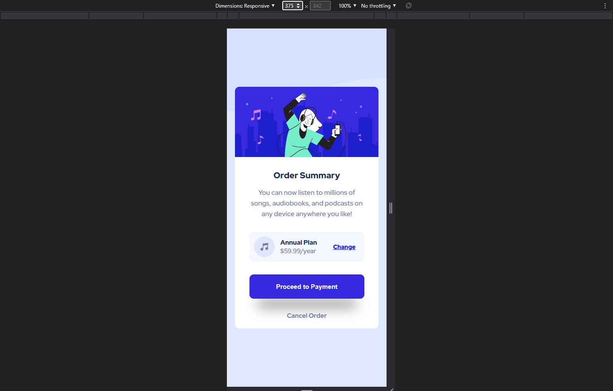
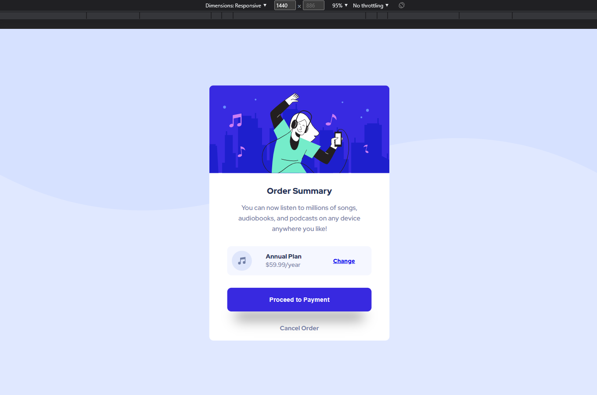

# Frontend Mentor - Order summary card solution

This is a solution to the [Order summary card challenge on Frontend Mentor](https://www.frontendmentor.io/challenges/order-summary-component-QlPmajDUj). Frontend Mentor challenges help you improve your coding skills by building realistic projects.

## Table of contents

  

- [Frontend Mentor - Order summary card solution](#frontend-mentor---order-summary-card-solution)
  - [Table of contents](#table-of-contents)
  - [Overview](#overview)
    - [The challenge](#the-challenge)
    - [Screenshots](#screenshots)
  - [Mobile](#mobile)
  - [Desktop](#desktop)
    - [Links](#links)
  - [My process](#my-process)
    - [Built with](#built-with)
    - [What I learned](#what-i-learned)
    - [Continued development](#continued-development)
  - [Author](#author)

    

## Overview

### The challenge

Users should be able to:

- See hover states for interactive elements
      

### Screenshots

  

## Mobile

  

## Desktop

   

### Links

- Solution URL: [https://github.com/rishi-jsdev/03-order-summary-component](https://github.com/rishi-jsdev/03-order-summary-component)
- Live Site URL: [https://rishi-jsdev.github.io/03-order-summary-component/](https://rishi-jsdev.github.io/03-order-summary-component/)
     

## My process

### Built with

- Semantic HTML5 markup
- SASS/SCSS
- BEM
- Flexbox
     

### What I learned

Used Webpack to compile basicSASS/SCSS to CSS. Used basic BEM methodology.
   

### Continued development

Want to focus on more complex layouts using CSS Grids with flexbox.
   

## Author

- Frontend Mentor - [@rishi-jsdev](https://www.frontendmentor.io/profile/rishi-jsdev)
